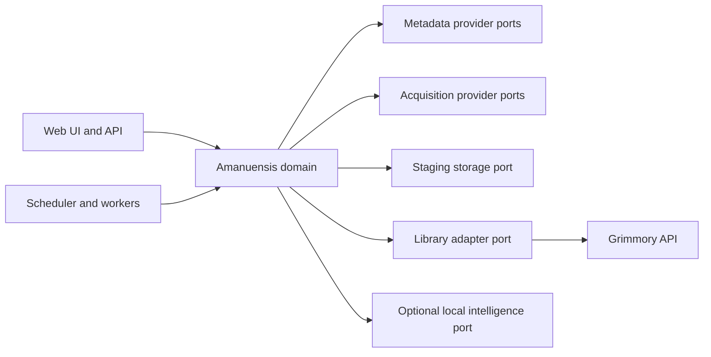

# Architecture

Amanuensis follows a ports-and-adapters architecture. The domain owns workflow
states and evidence; integrations translate external systems into those contracts.



## Core entities

- `Work`: intellectual work independent of edition or file.
- `Publication`: edition or periodical issue with identifiers and contributors.
- `ContentEntry`: a story, article, chapter, scenario, review, or other contained
  contribution, optionally with page boundaries.
- `FileCandidate`: acquired file plus hashes, format, quality signals, and origin.
- `Request`: user intent to follow or acquire an entity.
- `Evidence`: source, observation, timestamp, confidence, and optional locator.
- `Proposal`: a non-destructive metadata or file operation backed by evidence.
- `JobRun`: durable execution, progress, findings, and outcome.

## Staging lifecycle

```text
queued
  -> acquiring
  -> acquired
  -> identifying
  -> review_required | ready_to_import | quarantined
  -> importing
  -> imported
```

Retryable failures may return to `queued` after backoff. Final failures and
quarantined items require an explicit policy or review action.

## Integration rules

- Grimmory integration uses its supported API and import surfaces whenever
  possible; direct database access is not part of the public architecture.
- Provider-specific rate limits, credentials, caching, and attribution remain
  inside provider adapters.
- Paths are configuration values represented by logical storage roles.
- No adapter may mark a file imported before the library confirms the operation.
- Original files remain immutable during analysis. Repairs create a plan and a
  derived candidate before any replacement policy is applied.

## Acquisition architecture

Catalogue discovery and file transfer are deliberately separate ports:


The same Ephemera compatibility object can implement both ports during
migration, but the coordinator does not require that coupling. A metadata-rich
catalogue and a distinct lawful file provider may therefore be composed without
changing queue or workflow code.

The durable states are `wanted`, `searching`, `queued`, `downloading`, `delayed`,
`available`, `staging`, `staged`, `failed_retryable`, `failed_final`, and
`cancelled`. Retryable work receives a new queue sequence, so a failing source
cannot monopolize the front of the queue. Every transition appends a timestamped
event with the selection evidence or failure reason.

The Ephemera compatibility adapter maps its public search, queue, status, retry,
cancel, and file routes into these contracts. Provider rate-limit, quota, and
anti-automation failures remain provider failures; Amanuensis records and
schedules them but does not bypass provider controls.

## Search architecture

Content search is retrieval with evidence, not free-form generation:

1. Accept only an explicit, resolved set of selected book identifiers.
2. Extract page- or chapter-addressable text already present in the files.
3. Preserve immutable source units and character offsets.
4. Index overlapping passages for lexical and semantic candidate retrieval.
5. Fuse and rerank candidates inside the selected scope.
6. Merge adjacent or overlapping hits by their source offsets.
7. Return verbatim excerpts with book, chapter/page, and passage locators.

The search path does not contain answer generation, summarization, translation,
or paraphrasing. Image-only files remain visibly unindexed unless a separately
configured OCR adapter supplies source text.

The implementation separates four concerns:

1. a source-text store for immutable units and offsets;
2. a lexical index for exact terms and phrases;
3. a semantic index for concept-level recall;
4. a deterministic assembler that copies source spans.

`extraction.py` reads the EPUB spine and PDF text layer into immutable
`SourceUnit` records. `indexing.py` creates overlapping windows with stable IDs
and exact character offsets. `SQLiteSearchStore` persists source units, passages,
and corpus membership. `QdrantHybridPassageIndex` stores BGE-M3 dense and sparse
vectors and fuses both candidate lists with RRF.

The explicit book filter is sent to every Qdrant prefetch branch and the fused
query. Amanuensis then validates every returned payload again before source text
is read. A backend result outside the selected set is an error, not a result to
hide in the UI.

PyLate/ColBERT remains an optional reranking experiment after the baseline has
been measured. It is not on the current production path and may not alter source
text or widen the resolved scope.
