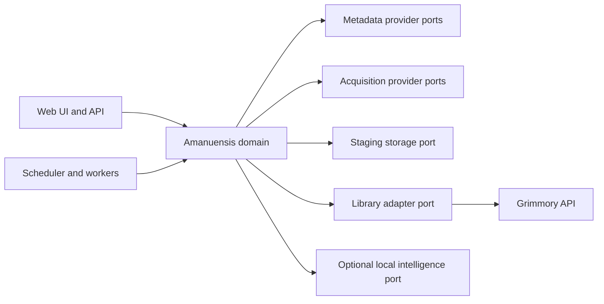

# Architecture

Amanuensis follows a ports-and-adapters architecture. The domain owns workflow
states and evidence; integrations translate external systems into those contracts.



## Core entities

- `Work`: intellectual work independent of edition or file.
- `Publication`: edition or periodical issue with identifiers and contributors.
- `ContentEntry`: a story, article, chapter, scenario, review, or other contained
  contribution, optionally with page boundaries.
- `FileCandidate`: acquired file plus hashes, format, quality signals, and origin.
- `Request`: user intent to follow or acquire an entity.
- `Evidence`: source, observation, timestamp, confidence, and optional locator.
- `Proposal`: a non-destructive metadata or file operation backed by evidence.
- `JobRun`: durable execution, progress, findings, and outcome.

## Staging lifecycle

```text
queued
  -> acquiring
  -> acquired
  -> identifying
  -> review_required | ready_to_import | quarantined
  -> importing
  -> imported
```

Retryable failures may return to `queued` after backoff. Final failures and
quarantined items require an explicit policy or review action.

## Integration rules

- Grimmory integration uses its supported API and import surfaces whenever
  possible; direct database access is not part of the public architecture.
- Provider-specific rate limits, credentials, caching, and attribution remain
  inside provider adapters.
- Paths are configuration values represented by logical storage roles.
- No adapter may mark a file imported before the library confirms the operation.
- Original files remain immutable during analysis. Repairs create a plan and a
  derived candidate before any replacement policy is applied.

## Search architecture

Semantic search is retrieval with evidence, not free-form generation:

1. Extract page- or chapter-addressable text.
2. Preserve document, edition, page, and section provenance.
3. Build lexical and vector indexes behind a search port.
4. Let an optional local model expand or disambiguate the query.
5. Return ranked passages with exact locators.
6. Generate summaries only from the selected passages and keep citations visible.
